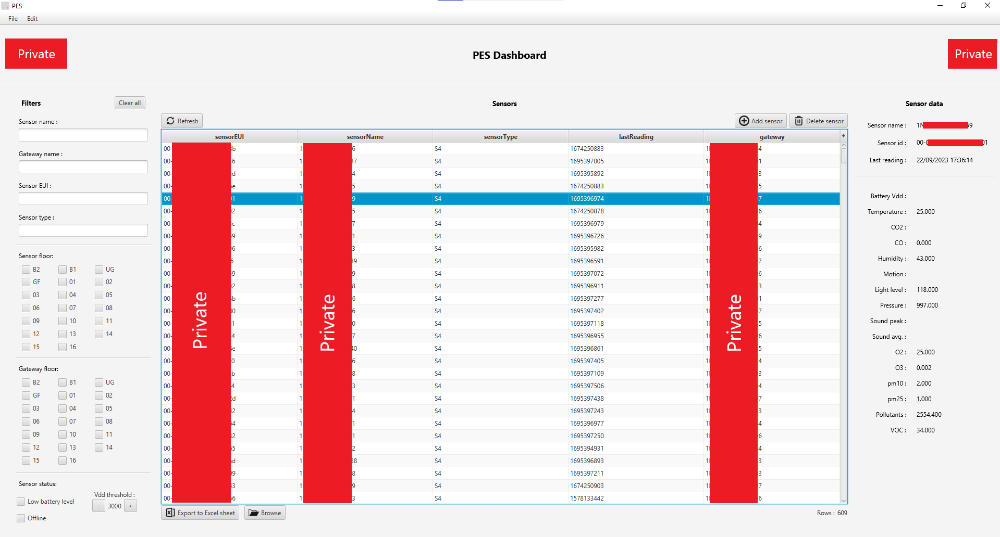

# PES_Overview
PES UI is a desktop application designed to display real-time data from LoRaWAN environmental sensors. These sensors transmit their readings to a Node-RED gateway, which then pushes the data into a MySQL database. PES UI seamlessly extracts this data from the MySQL database and presents it in an intuitive, user-friendly interface. Users can easily monitor and analyze sensor readings such as temperature, humidity, air quality, and more.
To enhance usability, PES UI offers advanced filtering options, allowing users to filter data based on sensor name, ID, type, location, gateway name, gateway location, and other criteria. This enables precise tracking and analysis of environmental conditions across multiple sensors and locations. With PES UI, users have quick access to up-to-date sensor data, ensuring a reliable and efficient way to track and manage environmental conditions.

